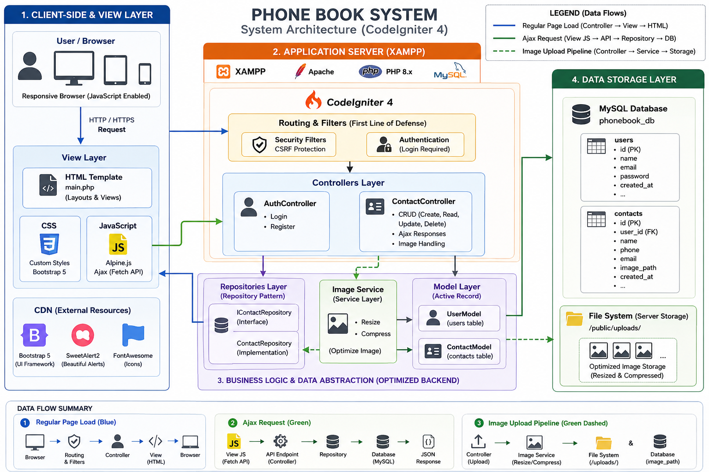

# Phone Book System

A CodeIgniter 4 web application for managing personal contacts. The system includes user authentication, protected contact management, profile image uploads, searchable/paginated contact cards, AJAX pagination, and a responsive interface for desktop and mobile.

## Features

- User registration, login, logout, and session-based access control
- Protected contacts area using `AuthFilter`
- Create, view, edit, and delete contacts
- Contact profile image upload with server-side image resizing/cropping
- Secure per-user contact access
- AJAX contact delete flow with SweetAlert2 confirmation
- Full-list backend search by name, phone, or email
- AJAX pagination powered by Alpine.js and `fetch()`
- Responsive login, register, and contacts pages
- Repository pattern for contact data access

## System Architecture



The application follows a simple MVC structure with SOLID principles:

- Routes define public authentication pages and protected contact routes.
- Controllers handle request flow, validation, sessions, redirects, and AJAX responses.
- Models represent database tables.
- Repositories isolate contact data access logic.
- Views render the authentication screens and contacts UI.
- Filters protect contact routes from unauthenticated users.

**SOLID Principles**: The application uses interfaces (e.g., `ContactRepositoryInterface`) to define contracts for data access layers. This adheres to the Dependency Inversion Principle (DIP) by ensuring that high-level modules depend on abstractions rather than concrete implementations, promoting loose coupling and testability.

## Tech Stack

- PHP 8.2+
- CodeIgniter 4.7
- MySQL or another CodeIgniter-supported database
- Bootstrap 5
- Alpine.js
- SweetAlert2
- FakerPHP for seed data

## Project Structure

```text
app/
  Controllers/
    AuthController.php
    ContactController.php
  Database/
    Migrations/
    Seeds/PhoneBookSeeder.php
  Filters/AuthFilter.php
  Interfaces/ContactRepositoryInterface.php
  Models/
    ContactModel.php
    UserModel.php
  Repositories/ContactRepository.php
  Views/
    auth/
    contacts/
    layout/main.php
docs/images/
  system-architecture.png
public/
  assets/
  uploads/
```

## Installation

1. Install dependencies:

```bash
composer install
```

2. Create your environment file:

```bash
cp env .env
```

3. Configure `.env`:

```ini
CI_ENVIRONMENT = development
app.baseURL = 'http://localhost:8080/'

database.default.hostname = localhost
database.default.database = phonedb
database.default.username = root
database.default.password =
database.default.DBDriver = MySQLi
database.default.port = 3306
```

4. Run migrations:

```bash
php spark migrate
```

5. Optional: seed demo data:

```bash
php spark db:seed PhoneBookSeeder
```

Seeded demo account:

```text
Username: testadmin
Password: password123
```

6. Start the development server:

```bash
php spark serve
```

Open the app at:

```text
http://localhost:8080
```

## Main Routes

| Method | Route | Description |
| --- | --- | --- |
| GET | `/` | Login page |
| GET | `/login` | Login page |
| POST | `/loginProcess` | Process login |
| GET | `/register` | Register page |
| POST | `/registerProcess` | Process registration |
| GET | `/logout` | Logout user |
| GET | `/contacts` | Contact dashboard |
| POST | `/contacts/store` | Create contact |
| GET | `/contacts/edit/{id}` | Fetch contact for edit modal |
| POST | `/contacts/update/{id}` | Update contact |
| DELETE | `/contacts/delete/{id}` | Delete contact |

## Contact Search And Pagination

Search is handled on the backend before pagination, so results can be found across all pages. The contacts page uses Alpine.js and AJAX to update only the contact list and pagination controls without refreshing the full page.

Example:

```text
/contacts?search=lina
```

## Image Uploads

Uploaded contact profile images are stored in:

```text
public/uploads/
```

Images are resized and cropped to `300x300` before saving. Contacts without an uploaded image use a generated avatar.

## Notes

- Point your web server document root to the `public/` directory.
- Keep `.env` out of version control.
- Ensure `public/uploads/` is writable by the web server.
